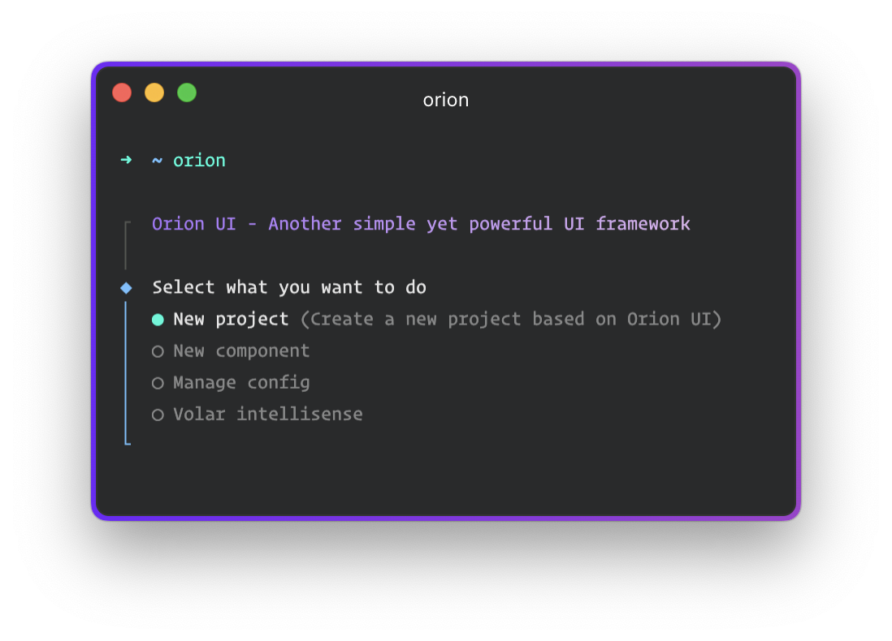

# 👾 CLI tool for Orion UI




## Installation

```sh
# Install globally
npm i -g @orion.ui/orion-cli

# Trigger CLI
orion
```

## Tools
- Scaffold new project based on **Vue 3** and **Orion UI**
- Create new component using our **SetupService** philosophy (or not)
- Manage Orion CLI config for each project
- Create **Volar** definition file for Orion's components to enhance intellisense and DX

## More infos on [Orion UI official documentation](https://orion-ui.org)

## License 

[MIT](https://opensource.org/licenses/MIT) Copyright (c) 2023-present Orion UI